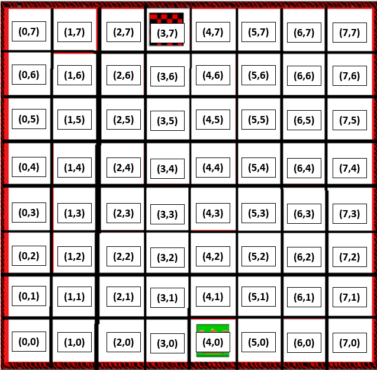
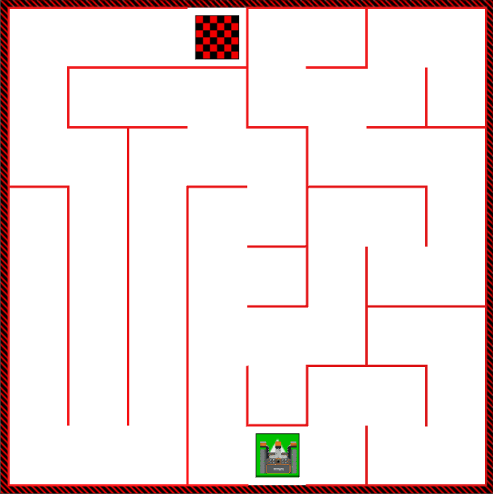

# Robotics

## Assignment Title: A mouse in a maze

---

## Project Overview
In this task the VEX VR robot platform is used to perform a simulated mouse escaping a maze.

The robot:
1. Explores and maps an 8×8 maze
2. Detects and stores wall data
3. Records visited tiles
4. Computes the shortest route using the A* algorithm
5. Drives to the finish tile using the shortest route
6. Returns safely back to the start position

<div align="center">
  
</div>

## Environment

- **Playground dimensions**: 2000mm × 2000mm
- **Coordinate range**: -1000mm to +1000mm (X and Y axes)
- **Maze grid size**:  8 × 8
- **Tile size**: 250mm per tile

> [!NOTE]
> Each tile in the maze corresponds exactly to one 1000 / 4 = 250mm robot movement.

[Coordinate-System-in-VEXcode](https://kb.vex.com/hc/en-us/articles/360041366072-Understanding-the-Coordinate-System-in-VEXcode-VR#directions-header-4https://kb.vex.com/hc/en-us/articles/360041366072-Understanding-the-Coordinate-System-in-VEXcode-VR#directions-header-4)

---
### Architecture

The program is divided into four main systems:

#### 1. Maze Exploration

- Uses front distance sensor for wall detection
- Converts real-world millimetre coordinates into grid coordinates
- Implements right-hand wall following movement logic
- **Stores**:
  - Visited tiles (maze_grid)
  - Wall data (maze_walls)
  - Full movement history (path_history)

#### 2. Maze Mapping
Each tile stores wall data in four directions:

```
{"N": False, "E": False, "S": False, "W": False}
```

#### 3. Shortest Path Algorithm – A*

The robot uses the A* search algorithm to calculate the optimal path.

A* is chosen because:
- It guarantees the shortest path
- It is more efficient than Dijkstra’s algorithm
- It uses informed search via a heuristic

**Heuristic Used**: Manhattan Distance
```
h(n) = |x_1 - x_2| + |y_1 - y_2|
```
- The robot moves only in four directions
- No diagonal movement is allowed
- Each move has equal cost (1 tile)

#### 4. Return-to-Home
After reaching the finish tile:
- The robot recalculates the shortest path
- Navigates safely back to the starting tile
- Reuses the same A* function

---

### Key Functions

#### refresh_status()
Updates live robot X, Y and heading values.
```python
def refresh_status():
    global robot_status
    robot_status[0] = location.position(X, MM)
    robot_status[1] = location.position(Y, MM)
    robot_status[2] = drivetrain.heading(DEGREES)
```

#### update_maze_list()
- Converts world coordinates into grid indices
- Detects walls
- Updates visited tile list

#### astar(start, goal)
- Implements A* search
- Uses g_score and f_score dictionaries
- Returns optimal tile path

#### drive_quickest_route(target_tile)
- Converts A* path into physical robot movement
- Adjusts heading
- Drives tile-by-tile
```python
def drive_quickest_route(target_tile):
    curr_row, curr_col, curr_heading = update_maze_list()
    path = astar((curr_row, curr_col), target_tile)
    
    if not path:
        brain.print("\nNo path found to target!\n")
        return

    # Highlight the travel path
    pen.move(DOWN)
    pen.set_pen_color(GREEN) 
    pen.set_pen_width(MEDIUM)

    for next_row, next_col in path:
        if next_row > curr_row: 
            target_h = 0
        elif next_row < curr_row: 
            target_h = 180
        elif next_col > curr_col: 
            target_h = 90
        elif next_col < curr_col: 
            target_h = 270
        
        drivetrain.turn_to_heading(target_h, DEGREES)
        drivetrain.drive_for(FORWARD, 250, MM)
        curr_row, curr_col = next_row, next_col
```

----
### False Wall
To handle the maze that has a false wall , a manual wall is created within the while loop

<div align="center">
  
</div>

```python
# Create a wall between (6,0) and (6,1)
maze_walls[6][0]["E"] = True
maze_walls[6][1]["W"] = True
```

----

### Project Features 

| Feature                        | Status | Notes          |
| ------------------------------ | ------ | ---------------
| Full maze exploration          | ✅     | Implemented     
| Dynamic wall detection         | ✅     | Implemented                   
| ASCII map rendering in console | ✅     | Implemented                   
| Path history logging           | ✅     | Implemented                
| A* shortest path computation   | ✅     | Implemented              
| Efficient tile-based movement  | ✅     | Implemented             
| Return-to-start functionality  | ✅     | Implemented         

---

### Future Improvements

- Use one loop to explore all maze including one with false wall
- Compare A* algorithm to other algorithms 

---

### References

- [**Readme**](https://getmarkon.com)
- [**Maze Runner - Shortest Path Algorithms**](https://www.kaggle.com/code/mexwell/maze-runner-shortest-path-algorithms#Introduction)
- [**A-Star (A\*) Search for Solving a Maze using Python (with visualization)**](https://levelup.gitconnected.com/a-star-a-search-for-solving-a-maze-using-python-with-visualization-b0cae1c3ba92)
- [**The A\* Algorithm: A Complete Guide**](https://www.datacamp.com/tutorial/a-star-algorithm)
- [**Unit 2 - Moving Your Robot**](https://education.vex.com/stemlabs/cs/cs-level-1-vexcode-vr-python/moving-your-robot/introduction)
- [**Unit 4 - Navigating a Maze**](https://education.vex.com/stemlabs/cs/cs-level-1-vexcode-vr-python/navigating-a-maze/introduction)
- [**Unit 5 - Detecting Walls from a Distance**](https://education.vex.com/stemlabs/cs/cs-level-1-vexcode-vr-python/detecting-walls-from-a-distance/introduction)
- [**Using Example Python Projects in VEXcode VR**](https://kb.vex.com/hc/en-us/articles/360052385852-Using-Example-Python-Projects-in-VEXcode-VR)
- [**Vex Vr 8 - Dynamic Wall Maze**](https://www.youtube.com/watch?v=xh4l72Lf8W0)
- [**Coordinate-System-in-VEXcode**](https://kb.vex.com/hc/en-us/articles/360041366072-Understanding-the-Coordinate-System-in-VEXcode-VR#directions-header-4https://kb.vex.com/hc/en-us/articles/360041366072-Understanding-the-Coordinate-System-in-VEXcode-VR#directions-header-4)
---